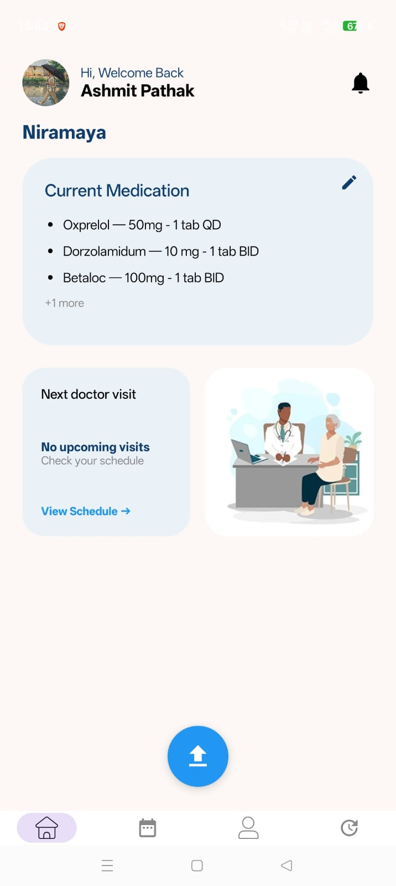
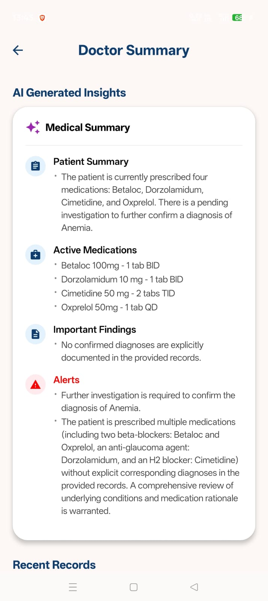
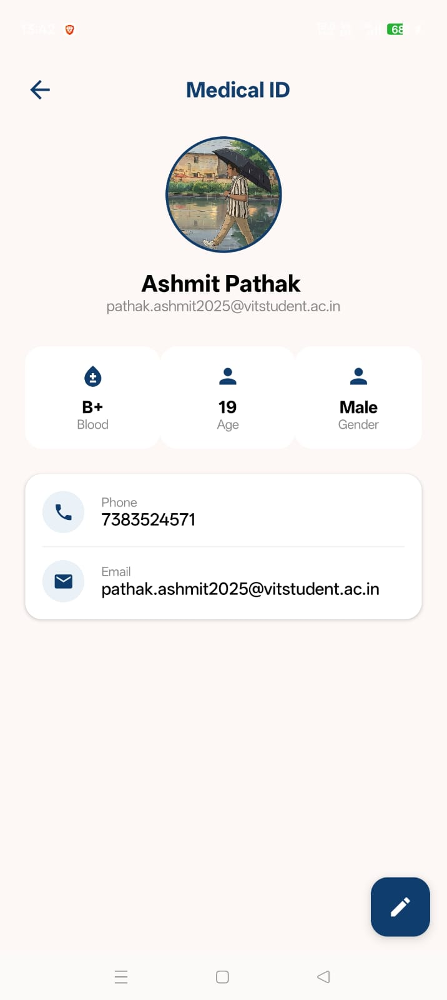

# 🏥 Niramaya: Privacy-First Medical Vault

> **Project for DevSoc'26**
> An offline-first, hardware-encrypted Android application for secure medical record management and emergency response.

   

---

## 🚀 Overview

**Niramaya** (Sanskrit for "Free from Disease") was built during **DevSoc'26** as a secure digital vault for your medical history. Unlike standard health apps that store data in plain text on cloud servers, Niramaya uses **Hardware-Backed AES-256 Encryption** to ensure that **only the user** holds the key to their data.

It features an **Emergency Lock Screen Widget** powered by Android Foreground Services, allowing first responders to view vital survival info (Blood Type, Allergies) without unlocking the device.

## ✨ Key Features

### 🔒 1. Zero-Knowledge Privacy Architecture
* **AES-256 GCM Encryption:** All sensitive medical data (Diagnosis, Prescriptions) is encrypted *on the device* before it ever touches the database.
* **Hardware-Backed Keys:** Decryption keys are generated inside the **Android Keystore System (TEE)**, meaning they cannot be extracted from the phone even if the device is rooted.
* **"Even We Can't See It":** The backend (Firebase) only stores encrypted gibberish. We have zero access to user health data.

### 🚑 2. Emergency "Fail-Safe" Mode
* **Lock Screen Access:** A persistent **Foreground Service** displays a non-dismissible notification with vital info (Blood Group, Allergies, SOS Contact) on the lock screen.
* **One-Tap SOS:** Instantly dials the configured emergency contact or Ambulance (112) directly from the app.

### 🧠 3. AI-Powered Report Analysis
* **Gemini 2.5 Flash Integration:** Uses Google's latest multimodal LLM to parse messy, handwritten medical prescriptions with superior accuracy and speed.
* **Smart Extraction:** Automatically converts raw images into structured data (Medicine Name, Dosage, Doctor Name) for easy searching.
* **Privacy Pipeline:** Images are processed in memory and encrypted immediately after extraction.

### 🔔 4. Intelligent Notification Bridge
* **Real-Time Alerts:** A custom background service listens to encrypted Firestore updates and triggers system-level push notifications for medicine reminders and doctor appointments.

---

## 🛠️ Tech Stack

* **Language:** Kotlin (100%)
* **UI Framework:** Jetpack Compose (Material 3 Design)
* **Backend:** Google Firebase (Firestore, Auth)
* **Storage:** Cloudinary (for encrypted PDF/Image blobs)
* **AI Model:** Gemini 2.5 Flash (via Google AI Studio)
* **Security:** Android Keystore System, AES-256 GCM
* **Architecture:** MVVM (Model-View-ViewModel)

---

## 📸 Screenshots

| **Secure Home** | **AI Analysis** | **Profile** |
|:---:|:---:|:---:|
|  |  |  |
---

## 🏗️ Installation & Setup

1.  **Clone the Repository**
    ```bash
    git clone [https://github.com/yourusername/niramaya.git](https://github.com/yourusername/niramaya.git)
    ```

2.  **Open in Android Studio**
    * File -> Open -> Select the `niramaya` folder.

3.  **Add API Keys**
    * Create a `local.properties` file in the root directory.
    * Add your Gemini API Key:
        ```properties
        GEMINI_API_KEY="your_api_key_here"
        ```

4.  **Firebase Setup**
    * Download your `google-services.json` from the Firebase Console.
    * Place it in the `app/` directory.

5.  **Build & Run**
    * Sync Gradle and run on an Emulator or Physical Device (API 26+ recommended).

---

## 🛡️ Security & Compliance

* **Data Sovereignty:** The user owns the decryption key. Deleting the app/account cryptographically shreds the data forever.
* **Minimal Permissions:** We only request Camera (for scanning) and Notification (for emergency alerts) permissions when absolutely necessary.
* **Right to Erasure:** A "Nuke Data" feature is available in Settings to comply with DPDP Act 2023 guidelines.

---

* ## ⚠️ Security Architecture & Limitations

**Strict Device-Bound Encryption:**
Niramaya uses **Device-Bound Keys** generated within the Android Keystore (TEE). This provides the highest level of security against remote attacks, but comes with a strict trade-off:

* **Forward Secrecy:** If the app is uninstalled or "Clear Data" is used, the decryption keys are **irreversibly destroyed** by the Android OS.
* **Data Recovery:** Because the keys are destroyed, any previously encrypted data in the cloud becomes permanently inaccessible (cryptographically shredded).
* **Re-installation:** Users reinstalling the app must **Reset Their Profile** to generate a new keypair. Old data cannot be recovered—this is by design to prevent data recovery from stolen/wiped devices.

*Future Roadmap:* We plan to implement **Passphrase-Based Key Wrapping** to allow secure key backup and recovery across devices.

---

## 👨‍💻 Team

* **Ashmit Pathak** - Team Lead & Lead Developer
* **Yash Bohra** - Android Developer
* **Shravan Mittal** - UI/UX Designer
* **Harshit Gupta** - Cloud Infrastructure & Firebase Management

---

## 📄 License

This project is licensed under the MIT License - see the [LICENSE](LICENSE) file for details.

---

> **Note for Judges:** This app requires a physical device to fully demonstrate the **Hardware-Backed Encryption** and **Lock Screen Notification** features. Emulators may not support the Android Keystore System fully.
